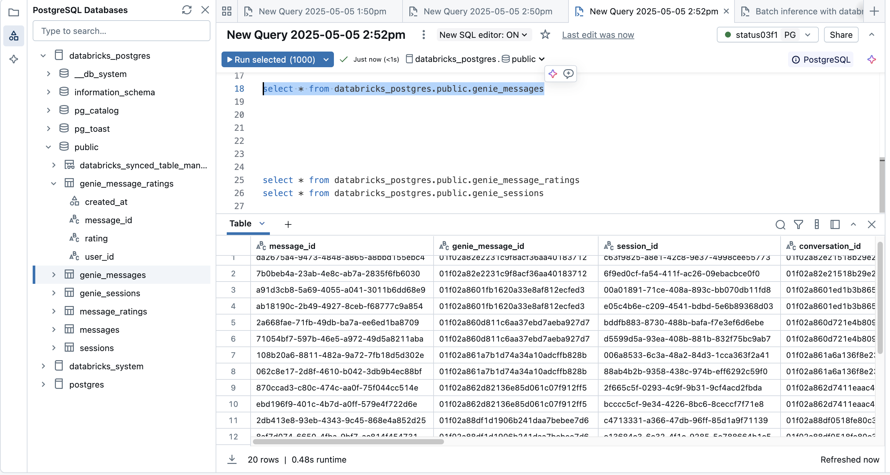
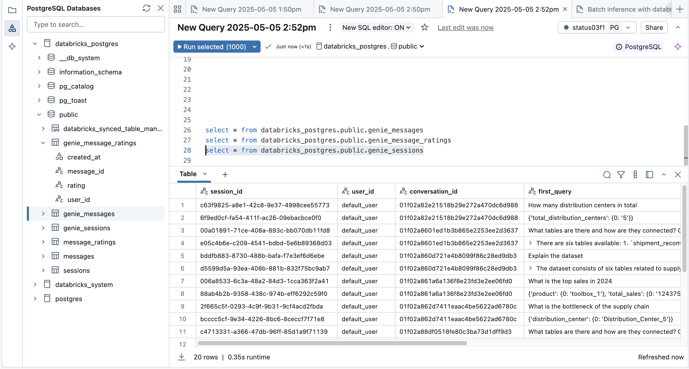
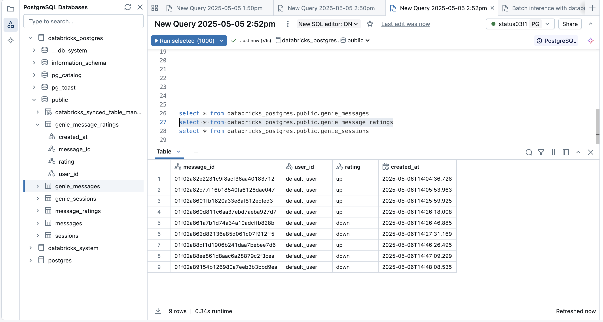
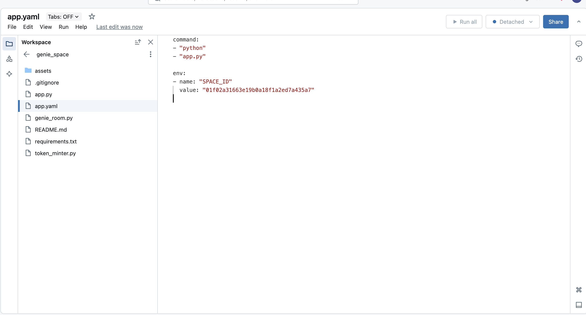
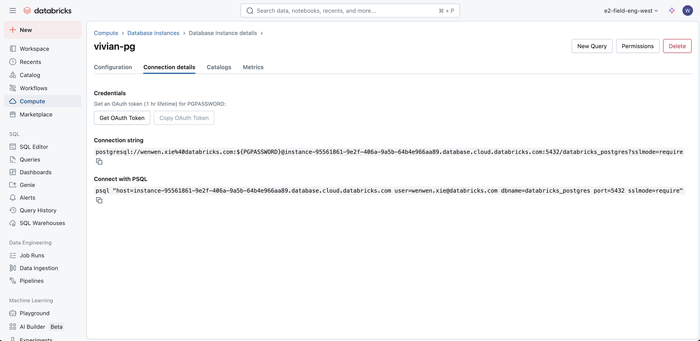
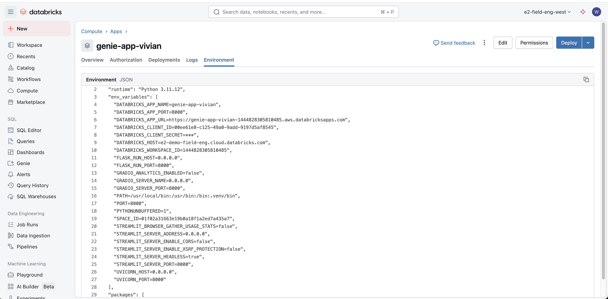

# Databricks Genie API Integration Demo






This repository demonstrates how to integrate Databricks' AI/BI Genie Conversation APIs into custom Databricks Apps applications, allowing users to interact with their structured data using natural language.

## PostgreSQL Integration

This app features a secure, token-aware integration with a Databricks-hosted PostgreSQL database. All chat history, message ratings, and session data are stored in PostgreSQL using Databricks OAuth tokens for authentication. The integration is managed via a custom connection pool in `db_config.py`


## Overview

This app is a Dash application featuring a chat interface powered by Databricks Genie Conversation APIs, built specifically to run as a Databricks App. This integration showcases how to leverage Databricks' platform capabilities to create interactive data applications with minimal infrastructure overhead.

The Databricks Genie Conversation APIs (in Public Preview) enable you to embed AI/BI Genie capabilities into any application, allowing users to:
- Ask questions about their data in natural language
- Get SQL-powered insights without writing code
- Follow up with contextual questions in a conversation thread

## Key Features

- **Powered by Databricks Apps**: Deploy and run directly from your Databricks workspace with built-in security and scaling
- **Zero Infrastructure Management**: Leverage Databricks Apps to handle hosting, scaling, and security
- **Workspace Integration**: Access your data assets and models directly from your Databricks workspace
- **PostgreSQL Integration**: All chat history, message ratings, and session data are stored in PostgreSQL using secure Databricks OAuth token management (see `db_config.py`)
- **Natural Language Data Queries**: Ask questions about your data in plain English
- **Stateful Conversations**: Maintain context for follow-up questions

## Example Use Case

This demo shows how to create a simple interface that connects to the Genie API, allowing users to:
1. Start a conversation with a question about their supply chain data
2. View generated SQL and results
3. Ask follow-up questions that maintain context


## Deploying to Databricks apps

1. Clone the repository to workspace directory such as 
/Workspace/Users/wenwen.xie@databricks.com/genie_space
```bash
git clone https://github.com/vivian-xie-db/genie_space_pg.git
```


2. Change the "SPACE_ID" environment value to the ID of your Genie space, for example, 01f02a31663e19b0a18f1a2ed7a435a7 in the app.yaml file in the root directory:

```yaml
command:
- "python"
- "app.py"

env:
- name: "SPACE_ID"
  value: "space_id"

```


3. Create an app in the Databricks apps interface and then deploy the path to the code


4. Grant the app service principal permission can_use to the SQL warehouse that powers genie


### Connect to PostgreSQL Database
1. Create an instance and get the connection details.


2. Go to your app and record the ID of the service principal that the app is using from the DATABRICKS_CLIENT_ID field on the app’s “Environment” page



3. Grant the service principal (DATABRICKS_CLIENT_ID) privileges

Use pg_databricks_create_role SQL function to create a role for PostgreSQL database and assign the appropriate privileges to the service principal on the database, schema and tables.
 


## Resources

- [Databricks Genie Documentation](https://docs.databricks.com/aws/en/genie)
- [Conversation APIs Documentation](https://docs.databricks.com/api/workspace/genie)
- [Databricks Apps Documentation](https://docs.databricks.com/aws/en/dev-tools/databricks-apps/)


