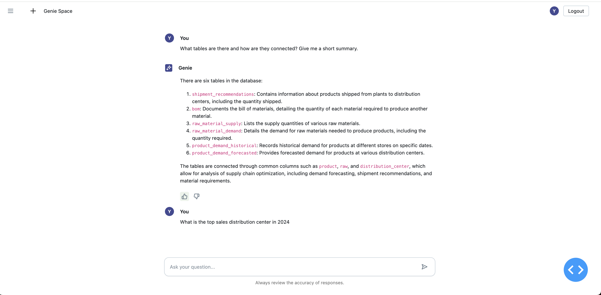

# Databricks Genie API Integration Demo





This repository demonstrates how to integrate Databricks' AI/BI Genie Conversation APIs into custom Databricks Apps applications, allowing users to interact with their structured data using natural language.

## PostgreSQL Integration

This app features a secure, token-aware integration with a Databricks-hosted PostgreSQL database. All chat history, message ratings, and session data are stored in PostgreSQL using Databricks OAuth tokens for authentication. The integration is managed via a custom connection pool in `db_config.py`


## Overview

This app is a Dash application featuring a chat interface powered by Databricks Genie Conversation APIs, built specifically to run as a Databricks App. This integration showcases how to leverage Databricks' platform capabilities to create interactive data applications with minimal infrastructure overhead.

The Databricks Genie Conversation APIs (in Public Preview) enable you to embed AI/BI Genie capabilities into any application, allowing users to:
- Ask questions about their data in natural language
- Get SQL-powered insights without writing code
- Follow up with contextual questions in a conversation thread

## Key Features

- **Powered by Databricks Apps**: Deploy and run directly from your Databricks workspace with built-in security and scaling
- **Zero Infrastructure Management**: Leverage Databricks Apps to handle hosting, scaling, and security
- **Workspace Integration**: Access your data assets and models directly from your Databricks workspace
- **PostgreSQL Integration**: All chat history, message ratings, and session data are stored in PostgreSQL using secure Databricks OAuth token management (see `db_config.py`)
- **Natural Language Data Queries**: Ask questions about your data in plain English
- **Stateful Conversations**: Maintain context for follow-up questions

## Example Use Case

This demo shows how to create a simple interface that connects to the Genie API, allowing users to:
1. Start a conversation with a question about their supply chain data
2. View generated SQL and results
3. Ask follow-up questions that maintain context

## Environment Setup

Clone the repository:
```bash
git clone <repository-url>
```

Create and activate a Python virtual environment:
```bash
python -m venv venv
source venv/bin/activate  # On Windows: .\venv\Scripts\activate
```

Install Python dependencies:
```bash
pip install -r requirements.txt
```

## Deploying to Databricks Apps

This application is designed to be deployed as a Databricks App, which provides several advantages:

- **Secure Authentication**: Leverages Databricks' built-in authentication
- **Access Control**: Inherits workspace permissions
- **Data Proximity**: Runs close to your data for optimal performance
- **Simplified Deployment**: No need for external hosting or infrastructure

### a. Install the Databricks CLI:

```bash
brew install databricks
```

### b. Create the app in your workspace:

```bash
databricks apps create genie-app
```

### c. Create an app.yaml file in the root directory:

```yaml
command:
- "python"
- "app.py"

env:
- name: "SPACE_ID"
  value: "01f02a31663e19b0a18f1a2ed7a435a7"
- name: "DB_HOST"
  value: "instance-3e8daf18-367d-4ee9-8273-c71f238f9b69.database.cloud.databricks.com"
- name: "DB_PORT"
  value: "5432"
- name: "DB_NAME"
  value: "databricks_postgres"
```

The `app.yaml` configuration defines the environment variables needed for Genie API and PostgreSQL integration. These variables are configured through Databricks Apps secrets or environment settings, securely storing and accessing sensitive values:

- `SPACE_ID`: The ID of your Genie space (e.g., 011xxxxxxxxxxxxxxx5ef)
- `DB_HOST`: Hostname of your Databricks PostgreSQL instance
- `DB_PORT`: Port for your PostgreSQL instance (default: 5432)
- `DB_NAME`: Name of your PostgreSQL database

For details on how to create an app in Databricks, please refer to the Databricks Apps Documentation.

### d. Sync your local files to Databricks workspace:

```bash
# Add node_modules/ and venv/ to .gitignore first if not already present
databricks sync --watch . /Workspace/Users/<your-email>/genie-app
```

### e. Deploy the app:

```bash
databricks apps deploy genie-app --source-code-path /Workspace/Users/<your-email>/genie-app
```

## Resources

- [Databricks Genie Documentation](https://docs.databricks.com/aws/en/genie)
- [Conversation APIs Documentation](https://docs.databricks.com/api/workspace/genie)
- [Databricks Apps Documentation](https://docs.databricks.com/aws/en/dev-tools/databricks-apps/)


